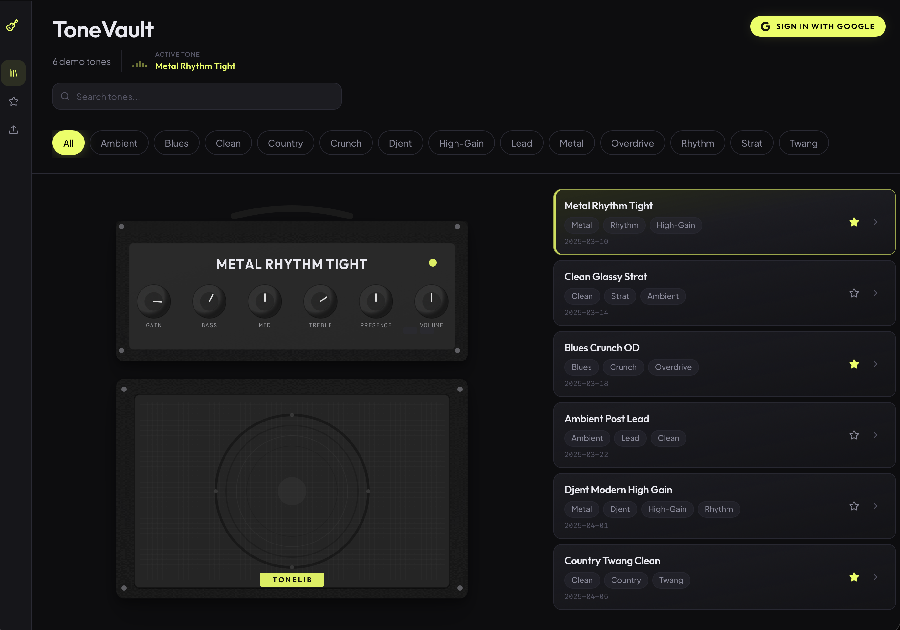

# ToneVault

A small web app for **organizing guitar tones** (NAM + IR style metadata and files): library, search, tags, favorites, and uploads. Guest users get a **demo library**; **sign in with Google** to save your own tones to **Supabase** (Postgres + Storage) with **row-level security** per user.

## Screenshots



Why bother? For a public GitHub repo, a screenshot on the first scroll makes the project understandable without cloning; it is optional but a good idea for UI-heavy apps.

## Features

- **Library** with search, tag filters, and a sidebar “amp” preview
- **Favorites** view
- **Upload / edit** tones (file metadata + NAM / IR file handling; signed-in use cloud storage)
- **Google OAuth** via Supabase; callback route: `/auth/callback`
- **Local + cloud**: Zustand with persistence as cache; Supabase for authenticated sync

## Stack

- **React 19** + **TypeScript** + **Vite**
- **Tailwind CSS**, **Framer Motion**, **react-router** v7
- **Supabase** (`@supabase/supabase-js`) for Auth, database, and Storage
- **Zustand** for client state

## Local development

```bash
npm install
cp .env.example .env
# Fill VITE_SUPABASE_URL and VITE_SUPABASE_ANON_KEY (and optionally VITE_SITE_URL)
npm run dev
```

Open the URL Vite prints (default `http://localhost:5173`).

| Script            | Description         |
| ----------------- | ------------------- |
| `npm run dev`     | Dev server with HMR |
| `npm run build`   | Production build    |
| `npm run preview` | Preview `dist`      |
| `npm run test`    | Run Vitest          |
| `npm run lint`    | ESLint              |

## Environment variables

| Variable                 | Purpose                                                      |
| ------------------------ | ------------------------------------------------------------ |
| `VITE_SUPABASE_URL`      | Supabase project URL                                         |
| `VITE_SUPABASE_ANON_KEY` | Supabase **anon (public) key** — safe in the client with RLS |

| `VITE_SITE_URL`  
Vite only exposes env vars that start with `VITE_`.

## Supabase (production-style setup)

1. Create a project and add the `tones` table (and any columns your version of the app expects — see `docs/PHASE_3_CURSOR.md` and later phase docs in `docs/`).
2. Add storage buckets (e.g. `nam-files`, `ir-files`) and policies if you use uploads.
3. Enable **Google** under Authentication → Providers and configure **redirect URLs** for your app (local + production), including `/auth/callback`.
4. Run **Row Level Security** for `tones` so each user only sees their rows. Example SQL lives in `supabase/migrations/20260425120000_tones_rls.sql`.

## Deployment

A Vite app builds to `dist/`. For **Vercel**: Framework **Vite**, build `npm run build`, output `dist`, set the same `VITE_*` variables. See `docs/VERCEL_DEPLOY.md` for a short checklist.

## License

No license file is included yet. If you make the repo public, add a `LICENSE` file (e.g. MIT) if you want others to know how they may use the code.
